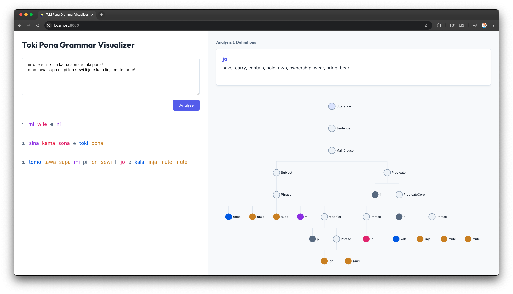
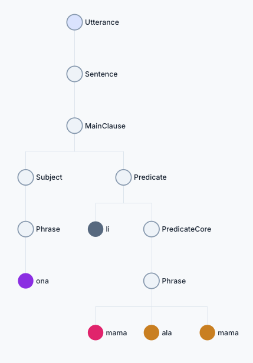

# toki-pona


A suite of tools for working with the toki-pona language.

## Table of Contents

- [Components](#components)
- [Usage](#usage)
  - [Web App](#web-app)
  - [Library](#library)
    - [Parsing](#parsing)
    - [Part of Speech Tagging](#part-of-speech-tagging)
    - [Constituency Parsing](#constituency-parsing)
  - [Corpus](#corpus)
- [About the Author](#about-the-author)
  - [My Interesting Links](#my-interesting-links)

## Components

| Component             | Description                                                                                                                |
| --------------------- | -------------------------------------------------------------------------------------------------------------------------- |
| `web`, `wasm`, `docs` | [A web app for visualizing toki-pona text.](https://adam-mcdaniel.github.io/toki-pona/)                                    |
| `corpus`              | A collection of toki-pona text for testing and analysis. Collected from lipu tenpo, kalama sin, lipu kule, and wikipesija. |
| `src`                 | A general purpose library for working with toki-pona text. Supports parsing into an AST, part of speech tagging, and more. |

## Usage

### Web App



The web app can be found at [https://adam-mcdaniel.github.io/toki-pona/](https://adam-mcdaniel.github.io/toki-pona/).

### Library

To use this library, add the following to your `Cargo.toml`:

```toml
[dependencies]
toki-pona = { "https://github.com/adam-mcdaniel/toki-pona.git" }
```

This will use the latest version of the library from this repository.

#### Parsing

Then, you can use the library in your code like this:

```rust
use toki_pona::{Text, Utterance};

fn main() {
    let text = Text::from("mi wile e ni: sina kama sona e toki pona!");
    println!("{:#?}", text);

    // Iterate over simple sentences, interjections, and vocatives.
    for (i, utterance) in text.utterances().enumerate() {
        println!("Utterance {}:", i);
        println!("{:#?}", utterance);

        match utterance {
            Utterance::Sentence(sentence) => {
                println!("La contexts: {:?}", sentence.contexts);
                println!("Main clause: {:#?}", sentence.main_clause);
            }
            Utterance::Vocative(invocation) => {
                println!("Vocative: {:#?}", invocation);
            }
            Utterance::Interjection(interjection) => {
                println!("Interjection: {:#?}", interjection);
            }
        }
    }

    // Iterate over spans of successfully parsed text
    for (i, span) in text.spans().enumerate() {
        println!("Span {}:", i);
        println!("{:#?}", span);
    }

    // Iterate over spans and utterances
    for (span, utterance) in text.parsed() {
        println!("Span: {:?} Utterance: {:#?}", span, utterance);
    }

    // Iterate over unsuccessfully parsed spans
    for (span, error) in text.errors() {
        println!("Span: {:?} Error: {:#?}", span, error);
    }
    // If there are no errors, print "No errors"
    if text.errors().is_empty() {
        println!("No errors");
    }

    // Show the parsing coverage
    println!("Coverage: {}%", text.coverage_ratio() * 100.0);
}
```

#### Part of Speech Tagging

Sometimes it's useful to partition a sentence into its discrete words and assign the roles they each play in the sentence: whether it's a particle, noun, verb, preposition, etc. This is called part of speech tagging.

This is easily done with the `tag` method:

```rust
use toki_pona::Text;

fn main() {
    let text = Text::new("sina pali e ike la, ni li pona ala!");
    let tagged = text.tag();
    println!("Tagged: {:#?}", tagged);
}
```

#### Constituency Parsing

Constituency parsing is a way of breaking down a sentence into its simpler parts, without flattening the structure of the sentence into a list of words. This is useful for understanding the relational structure of a sentence!



```rust
use toki_pona::{Text, NodeKind};

fn main() {
    let text = Text::new("ona li mama ala mama?");
    let tree = text.constituents();
    println!("Tree: {:#?}", tree);
    // Root is Utterance
    assert_eq!(tree.len(), 1);
    let root = &tree[0];
    assert_eq!(root.kind, NodeKind::Utterance);

    // Child is Sentence
    assert_eq!(root.children.len(), 1);
    let sentence = &root.children[0];
    assert_eq!(sentence.kind, NodeKind::Sentence);

    // The sentence has no context clause (denoted with la),
    // so it only has the main clause
    let clause = &sentence.children[0];
    assert_eq!(clause.kind, NodeKind::MainClause);

    // The main clause has a subject and a predicate
    let subject = &clause.children[0];
    let predicate = &clause.children[1];
    assert_eq!(subject.kind, NodeKind::Subject);
    assert_eq!(predicate.kind, NodeKind::Predicate);

    // Print the subject and predicate
    println!("Subject: {:#?}", subject);
    println!("Predicate: {:#?}", predicate);
}
```

### Corpus

The corpus is a collection of toki-pona text for testing and analysis. Collected from lipu tenpo, kalama sin, lipu kule, and wikipesija.

Here's the directory structure:

```bash
corpus/
├── lipu-kule/*.md.      # https://lipukule.org/ (Normalized HTML)
├── lipu-tenpo/*.txt     # https://liputenpo.org/ (OCR from PDF)
├── lipu-tenpo-tok/*.txt # https://liputenpo.com/tok (Normalized HTML)
├── kalama-sin/*.mp3     # https://kalamasin.com/ (Scraped MP3)
└── wikipesija/*.txt     # https://wikipesija.com/ (Normalized HTML)
```

## About the Author

[I'm Adam McDaniel](https://adam-mcdaniel.github.io/), a software engineer and computer science PhD student at the University of Tennessee Knoxville. I'm passionate about programming languages, compilers, and formal methods. I'm a huge fan of Rust and functional programming, and I love building tools that help people write better software.

Here's some interesting links for some of my other projects:

### My Interesting Links

| Website                                                                                |
| -------------------------------------------------------------------------------------- |
| [My main programming language🧑‍💻](https://adam-mcdaniel.net/sage-website)               |
| [My shell🐚](https://adam-mcdaniel.net/dune-website/)                                  |
| [My blog📝](https://adam-mcdaniel.net/blog)                                            |
| [My YouTube📽️ (compilers and music)](https://youtu.be/QdnxjYj1pS0?si=pwvegcPkEvqmqF8b) |
